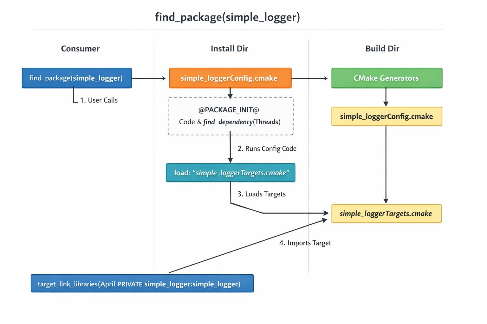

1. cd ~/hdd/storage/Logger/Logger/
2. rm -rf build install
3. mkdir build && cd build
4. cmake -DCMAKE_BUILD_TYPE=Release -DBUILD_SHARED_LIBS=ON ..
5. cmake --build .
6. cmake --install . --prefix ../install  # or /usr/local
7. cd ~/hdd/storage/April/
8. rm -rf build
9. mkdir build && cd build
10. cmake -DCMAKE_PREFIX_PATH=~/hdd/storage/Logger/Logger/install ..
11. cmake --build .
12. export LD_LIBRARY_PATH=~/hdd/storage/Logger/Logger/install/lib:$LD_LIBRARY_PATH && ./April

